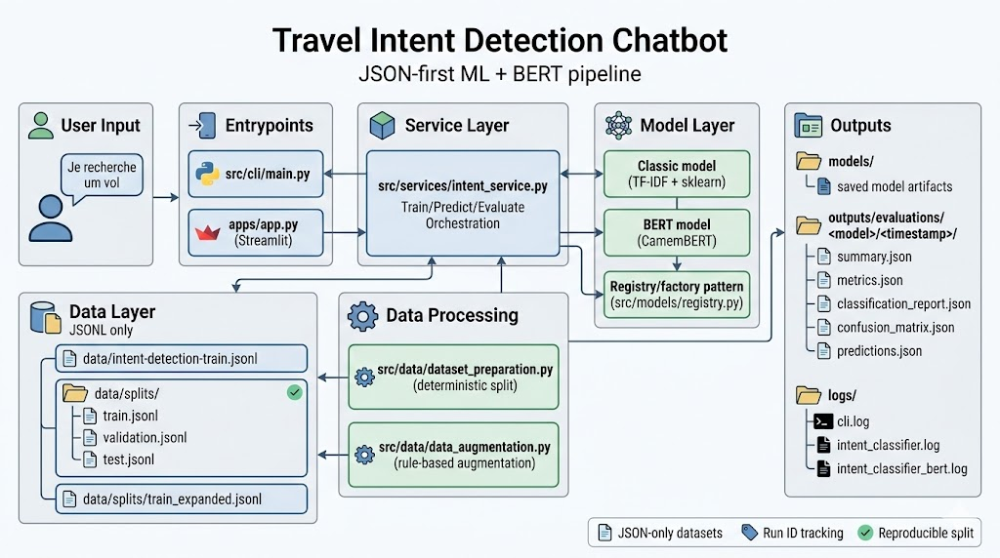

# Intent-Detection-for-Travel-Chatbots

<div align="center">
  
</div>

<div style="display: flex; gap: 10px;">
  <a href="data/intent-detection-train.jsonl">[Dataset]</a>
  <a href="reports/">[Reports]</a>
</div>

This project implements intent detection for a travel assistant chatbot, with two model backends:
- **classic ML** (`scikit-learn` models with TF-IDF)
- **BERT** (`CamemBERT` via Hugging Face + PyTorch)

The project has been refactored to use:
- a **central CLI**: `src/cli/main.py`
- a **shared YAML config**: `config/settings.yaml`
- shared utilities in `src/utils/`
- a Makefile-first workflow for local + Docker usage

## Project Structure

```text
Intent-Detection-for-Travel-Chatbots/
├── analysis/
│   ├── scripts/
│   │   ├── common.py              # Shared paths/I-O helpers for exploration scripts
│   │   ├── eda_report.py          # Dataset summary + intent distribution stats
│   │   ├── robustness_experiments.py # Lexical overlap + baseline CV experiments
│   │   ├── generate_stress_test.py   # Rule-based perturbed test generation
│   │   └── run_all.py             # Executes all exploration scripts in sequence
│   └── outputs/                   # Generated analysis artifacts (gitignored)
│       └── .gitkeep
├── apps/
│   └── app.py                      # Streamlit UI entrypoint
├── config/
│   └── settings.yaml               # Canonical runtime configuration
├── data/
│   ├── intent-detection-train.jsonl      # Canonical training dataset
│   ├── intent-detection-test-perturbed.jsonl  # Stress-test dataset
│   └── splits/                     # Deterministic split + augmentation artifacts
│       ├── train.jsonl
│       ├── validation.jsonl
│       ├── test.jsonl
│       ├── train_augmented_only.jsonl
│       └── train_expanded.jsonl
├── logs/                           # Runtime logs (CLI + per-model)
├── models/                         # Saved model artifacts/checkpoints
├── outputs/
│   └── evaluations/                # Structured evaluation outputs (JSON)
├── reports/                        # Deprecated legacy reports folder
├── src/
│   ├── cli/
│   │   └── main.py                 # Unified command router (train/predict/evaluate/prepare-data/augment-data)
│   ├── config/
│   │   ├── loader.py               # YAML loader + PROJECT_ROOT resolution
│   │   └── runtime_settings.py     # Centralized typed access to config-backed paths/settings
│   ├── data/
│   │   ├── dataset_preparation.py  # Deterministic stratified split generation
│   │   └── data_augmentation.py    # Rule-based text augmentation
│   ├── models/
│   │   ├── base.py                 # Shared model contract
│   │   ├── classic.py              # Classic sklearn pipeline implementation
│   │   ├── bert.py                 # CamemBERT implementation
│   │   └── registry.py             # Model factory/registry
│   ├── services/
│   │   ├── intent_service.py       # Orchestration logic for train/predict/evaluate
│   │   └── evaluation_outputs.py   # JSON artifact writer for evaluation runs
│   └── utils/
│       ├── dataset_utils.py        # Shared JSONL I/O + dataframe normalization helpers
│       ├── logging_utils.py        # Logger configuration helpers
│       └── run_utils.py            # run_id-aware message formatting helper
├── Dockerfile
├── Makefile                        # Local/Docker workflow shortcuts
├── requirements.txt
└── README.md
```

## Setup

### Local environment

```bash
python -m venv .venv
.venv\Scripts\python -m pip install --upgrade pip
.venv\Scripts\python -m pip install -r requirements.txt
```

Or with Makefile:

```bash
make install
```

## Unified CLI (`src/cli/main.py`)

All model operations now go through one entrypoint:

- Train:
```bash
python -m src.cli.main train --model classic --dataset data/intent-detection-train.jsonl
python -m src.cli.main train --model bert --dataset data/intent-detection-train.jsonl
```

- Predict:
```bash
python -m src.cli.main predict --model classic --text "Je recherche un vol"
python -m src.cli.main predict --model bert --text "Je recherche un vol"
```

- Evaluate:
```bash
python -m src.cli.main evaluate --model classic --dataset data/intent-detection-train.jsonl
python -m src.cli.main evaluate --model bert --dataset data/intent-detection-train.jsonl
```

## Makefile Workflow (Recommended)

### Local

```bash
make install
make prepare-data
make augment-data
make train MODEL=classic
make predict MODEL=classic TEXT="Je recherche un vol"
make evaluate MODEL=classic

make train MODEL=bert
make predict MODEL=bert TEXT="Je recherche un vol"
make evaluate MODEL=bert

make app
```

`make prepare-data` creates deterministic splits:
- `data/splits/train.jsonl`
- `data/splits/validation.jsonl`
- `data/splits/test.jsonl`

By default, `make train` and `make evaluate` use split files for fairer and more stable evaluation.

`make augment-data` builds an expanded training set from `data/splits/train.jsonl` and writes:
- `data/splits/train_augmented_only.jsonl`
- `data/splits/train_expanded.jsonl`

By default, training now uses `data/splits/train_expanded.jsonl`.

### Docker

Docker run targets **auto-build** image first:

```bash
make docker-train MODEL=classic
make docker-predict MODEL=classic TEXT="Je recherche un vol"
make docker-evaluate MODEL=classic

make docker-train MODEL=bert
make docker-predict MODEL=bert TEXT="Je recherche un vol"
make docker-evaluate MODEL=bert

make docker-app
```

Manual build if needed:

```bash
make docker-build
```

## Streamlit App

Run locally:

```bash
.venv\Scripts\python -m streamlit run apps/app.py
```

## Exploratory Analysis (Scripts)

Notebook-based exploration has been replaced with clean Python scripts.

Run all exploratory analyses:

```bash
python analysis/scripts/run_all.py
```

Or run scripts individually:

```bash
python analysis/scripts/eda_report.py
python analysis/scripts/robustness_experiments.py
python analysis/scripts/generate_stress_test.py
```

Generated outputs are written to `analysis/outputs/`.

## Logs and Outputs

- Logs: `logs/`
  - `intent_classifier.log`
  - `intent_classifier_bert.log`
- Structured evaluation outputs (primary): `outputs/evaluations/<model>/<timestamp>/`
  - `summary.json`
  - `metrics.json`
  - `classification_report.json`
  - `confusion_matrix.json`
  - `predictions.json`
- Models: `models/`
- Reports: `reports/` (deprecated; no longer written by evaluation flow)

## Notes

- If CamemBERT warns about unauthenticated Hugging Face requests, set `HF_TOKEN` for better rate limits.
- On Windows, if symlink warnings appear from `huggingface_hub`, enabling Developer Mode removes that warning but is optional.
